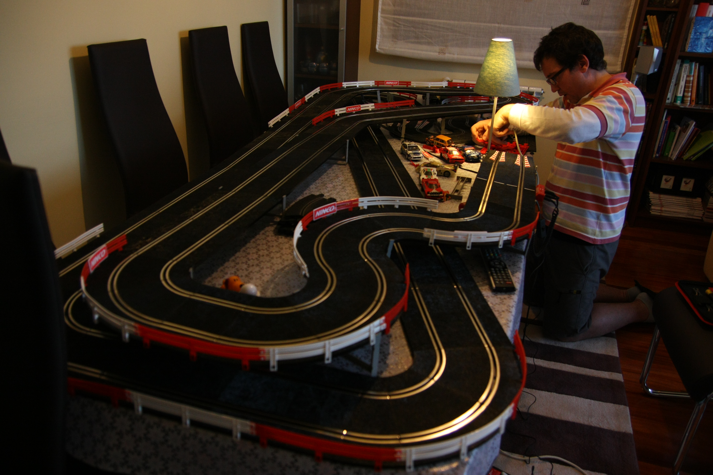
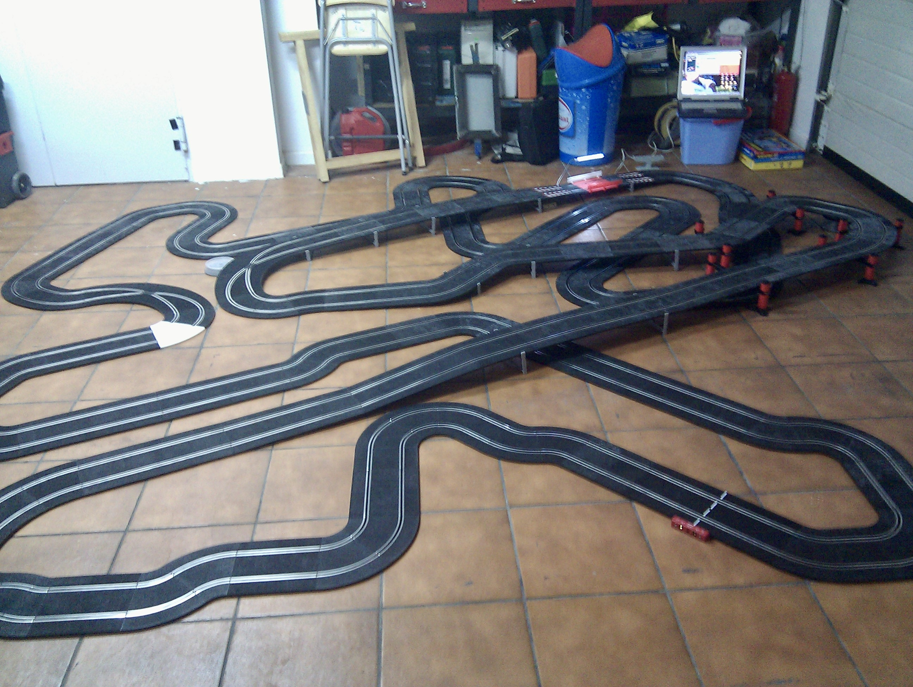
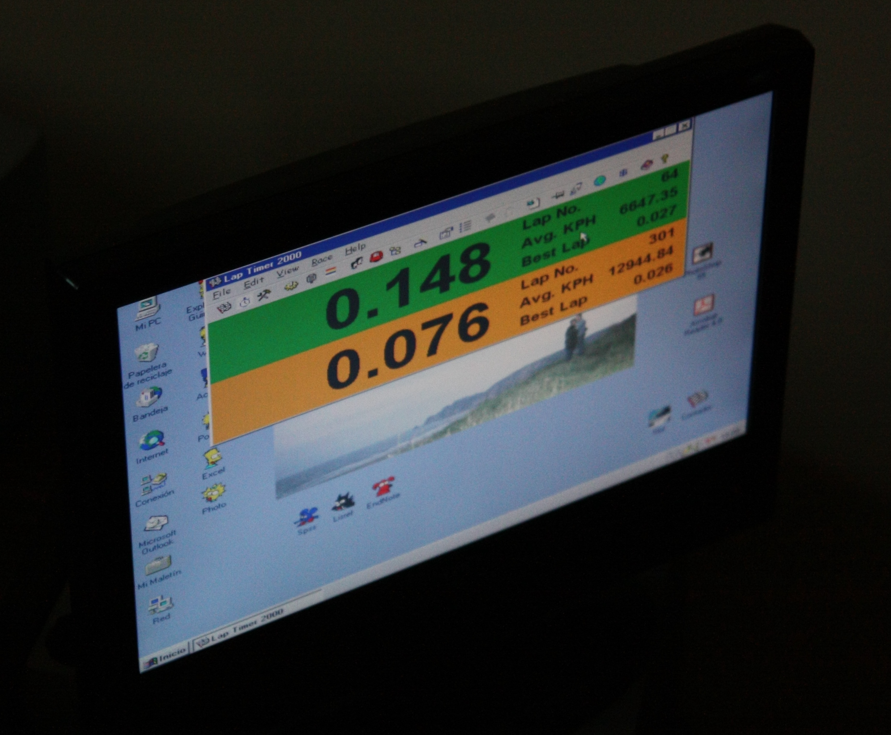

# Slotem Extremus

Welcome to the magnificent, useless, and super fun to build **Slotem Extremus** project!

One day I'll use this to track slot cars laps and races with Lena & Xana. In the meanwhile, I'm just having fun :D

## What is this about?

As any boy in the 80's, I loved my [Scalextric](https://www.scalextric.es). Around 2008, I went back to the hobby with a couple of friends.

It was in no time that things went a bit out of control...

Besides building ridiculously large tracks, we all understood the need for a better way to monitor our laps and manage our races. All we had was an old .exe running on Windows 95 and using the parallel port to read a couple of photocells drilled under a piece of track. The setup was outdated already back then.

Back in 2009, I wanted to make it with a native app and computer vision (with OpenCV). 2^8 years later (life happened in between, including moving to another country, Lena & Xana being born, etc), I made it happen with a Raspberry Pi (more on this in the [README of the lapdetector](lapdetector/README.md)).

Ultimately, this is all about learning and having fun with it. That's it.

## Why now?

It's a combination of factors, namely:

* As a frustrated game developer who became a C++ engineer and who later took the managereal path, I found the need to find my roots (ie. to code again).
* Although I really like management, I just got too dettached from tech, and the industry trend is now expecting managers to be either hands-on or very close to the code. The industry is now also laying people off, and I don't want to wait for it whining in a corner. Plus I only learn by doing.
* I wanted to try these AI agents and tools first hand. I didn't want to screw our production code, but I also wanted to do more than renaming labels or adding new buttons. A hobby project was the solution.
* Lena & Xana. I wanted to play slot cars with them when they turn 6, in Septermber 2026 (it happens that this will be ready way earlier though :D). I don't want them to play to _girls_ games but to any game, and we want us to do it together. In the end, it's all about them.

## What's the status of the project?

WIPMVS - that's it. _Work In Progress Minimum Viable Skeleton_, I would say, because:
* It's indeed WIP. I'm still working on it.
* It's viable. It definitely is.
* It's a mix between an MVP (for the lap detector) and a skeleton (for the frontend and backend).

Do you want to see it in action? Have a look at it [here](https://vimeo.com/1088439424/9c021f35b8) (it's not the latest version - just the first iteration with everything connected).

### Things that are done

* This repo is set.
* The high-level architecture is clear.
* Hardware constrains are identified.
* Platforms and technologies are all set.
* All the foreseen components have been proven to be feasible, and are actually interacting with each other.
* There's an MVP of the lap detector (arguably, the most challenging component).

### Things that are pending

* A real backend, including its data model, its endpoints, its business logic and its storage solution.
* A real frontend, including a nice UX that allows me to eventually enjoy the races.

### Things that would be nice to have

* Port the lap detector to C++ to boost its efficiency.
* Use AI (YOLO?) somehow sometimes somewhere for something.

## How does it work?

Since this was all about learning and having fun, I set a number of preconditions upfront, which somehow act as NFRs (non-functional requirements):
* I wanted to do the lap detection on a Raspberry Pi with a camera. Specifically, I had a 4 at home, so that was the one to go. Ideally, this should run on a 3 (I have two of those) and even in a Zero 2 (to make it super compact and battery opperated).
* I didn't want to use AI for motion detection and tracking. More on that below.
* I accept the slight time difference between the clocks of the different machines. I consider that the [Network Time Protocol](https://en.wikipedia.org/wiki/Network_Time_Protocol) is good enough for this project. In case of doubt, it's the Pi the one owning the master clock. Please note that Raspberry OS uses `systemd-timesyncd` instead of `ntp` by default, so you might want to enable the latter with `sudo apt install ntp` if you want a more accurate timing.
* Everything had to be wireless and as platform independent as possible (except the Pi for the lap detector).
* I wanted to build the lap detector using some sort of modern, efficient and new (to me) technology. First option was Rust, although this was soon discarded because libraries and bindings were either C++ or Python.
* I wanted to build a backend using some sort of modern, scalable and new (to me) technology. Go or Rust would be the way to go.
* I wanted to build a frontend using some sort of modern and new (to me) technology. First option would be Typescript + React.

Let's explore a bit more the scope and details of each component.

### Lap detector

It takes care of detecting the meta crossing and sending events (at least, timestamps + photo finish; at best, even slo-mo videos) to the server. It has to be as autonomous and flexible as possible.

It's been initially built with Python, but will be ported to C++ (Python is awesome for prototyping and terrible for efficiency). Those two languages are chosen because they are the native for both [OpenCV](https://opencv.org) and the [camera libraries offered by the Raspberry Pi Foundation](https://www.raspberrypi.com/documentation/computers/camera_software.html).

I decided to **not** use AI for detection and tracking initially. Nowadays it's very easy to do so, with either the [Raspberry AI Camera module](https://www.raspberrypi.com/products/ai-camera/), or one of the available [AI kits](https://www.raspberrypi.com/documentation/accessories/ai-kit.html). That can happen at a later stage, but in the beginning I wanted to face the real challenges with computer vision and image processing in the limited Pi resources.

More on the lap detector can be found in [its README file](lapdetector/README.md).

### Backend

It takes care of aggregating race data and offer them to the frontend(s). There's a whole range of shades between sending events right away to a single frontend, to holding, storing, aggregating multiple frontends, or even managing multiple races at the same time.

An MVP would mean that:
* There's a valid data model for races.
* There's a well defined API for both the lap detector and the frontend.
* I can have multiple devices (phone, tablet) _watching_ the same race, and all of them will be perfectly updated. It keeps all the connected frontend clients up to date.
* It allows clients to (re)connect at any time of the race, and they'll get the full snapshot of it.
* Stretch: Races are stored locally and can be browsed by the frontend.

It will use either Go or Rust. Even though the workload is going to be really low, and the frontend technology (Typescript) or the lap detector one (Python, C++) could be reused for simplicity, I still want to learn something new. Both Go and Rust are:
* Truly multi-threaded.
* Modern and well supported.
* Efficient and compiled, with no need for a runtime (they would allow me to be run in the same Pi than the lap detector).
* Somehow challening, as they lack classes, which are the foundation I built my development skills on.

### Frontend

It takes care of showing the status of the ongoing race and, optionally, to browse old races, configure drivers, etc. It has to offer some sort of real time feeling (ie. let's show a working chronograph, even though it might not be perfectly synchronized with the race clock).

An MVP would mean that:
* I can see the current lap time of a car.
* I can see the previous lap times of a car, together with their photo finish.
* I can restart a race.
* I can join a race at any moment and get a full snapshot.
* I get asynchronous updates without reloading the page.

It will use React + Typescript + Node. Those are the current industry standards and I can't think of a better option at this moment.

## Thoughts on AI?

Very, very positive. Having a companion that will (quite often) solve your problems is priceless. This hobby project would have not been a working skeleton in only two months without these new tools.

The main win? The frustration-less feeling. Those bugs like black holes, where you spent hours and hours with little to none progress, and you ended up asking in a forum begging for tips, are a thing of the past. Ask Copilot, copy&paste your code in ChatGPT, have a chat with DeepSeek+DeepThink... you name it - what matters is that you will never feel blocked any more, at very least they will give you new ideas. That's just awesome.

To me, it's like all these LLMs and agents have continued the worked that Google dropped around 2010. In the early 2000's, Google was just the way to navigate your issues, your source of knowledge. Later, they changed their business model and rather than focusing on providing meaningful answers, they preferred to give you whatever else. For now, LLMs are focusing on searching, aggregating, and summarizing valuable information for you, which is awesome.

Also, in the very beginning of the project I really enjoyed my _chats_ with DeepSeek+DeepThink. I really liked to see its thinking process, as it allowed me to spot flaws in my initial ideas. It was like having a geek colleague always available for you to discuss nerdy stuff and to get inspired by his concerns and ideas.

However, not everything has been so perfect. I'm also getting a bunch of good learnings while doing this...

### Your AI agent tries to please you

The better the prompt, the better the output. The problem is that we humans will implicitely share our intent when sharing details of our request, and the AI is a bad friend who rarely challenges you, but enforces you instead. For instance, I started this thing asking DeepSeek _how can I track my slot cars with my Pi to know when they cross the meta?_. And it enabled me. It allowed me to start everything of but... it never told me that I didn't actually need to track the cars! And that ended up being a huge waste of hours (well... it's never a waste when it's a hobby, but it would have been a waste if this was a professional project).

### Your AI agent is more narrow-minded than you wish

See all the unneeded? work on the motion detection and tracking in the lap detector component for more details. I think that this problem is related to the previous one: they get some kind of momentum based on your previous prompts, so you implicitely make them follow your lead, at least partially, even when I didn't mention the concept of _tracking_ anymore down the road.

### Your AI agent will hide critical aspects of the solutions

I knew that my lap detector had to be multi-threaded. The AI agent confirmed it. It never told me that Python threads are a scam :/

### The code is crap

I'm sorry, but it's like that. There's no linter or AI that can fix the code of an AI.

### I truly believe you need to be a developer first

An AI agent is a tool that needs to be challenged in order to get the best out of it. Otherwise, you'll be fooled (I would refer again to my microtrauma with Python threads in the lap detector...). If you haven't faced and solved real developer problems before using these tools, I think you'll be lacking some important foundation. It's like using languages with garbage collector without understanding how operating systems manage memory: yes, you'll write stuff faster, but the quality will be subaverage and I seriously doubt you'll have the capacity to understand and solve problems down the road.

## What's next?

I have absolutely no idea.

The amount of possible optimizations in the lap detector is huge, and so is the possibilities to build a user friendly and modern UI. I could even extend the data model in the backend to support partial times, like in F1. Or I could use some LLM to identify the car model. Or to track more than one car in the same lane at the same time. I'm also tempted to make this more efficient (I would love to see it running on a battery powered Raspberry Pi Zero, which has like half the CPU power and 1/8th of the RAM of my current Pi 4). 

Honestly, I don't know what's going to be next. In the end, it's all about enjoying the journey... and the races with Lena & Xana <3
