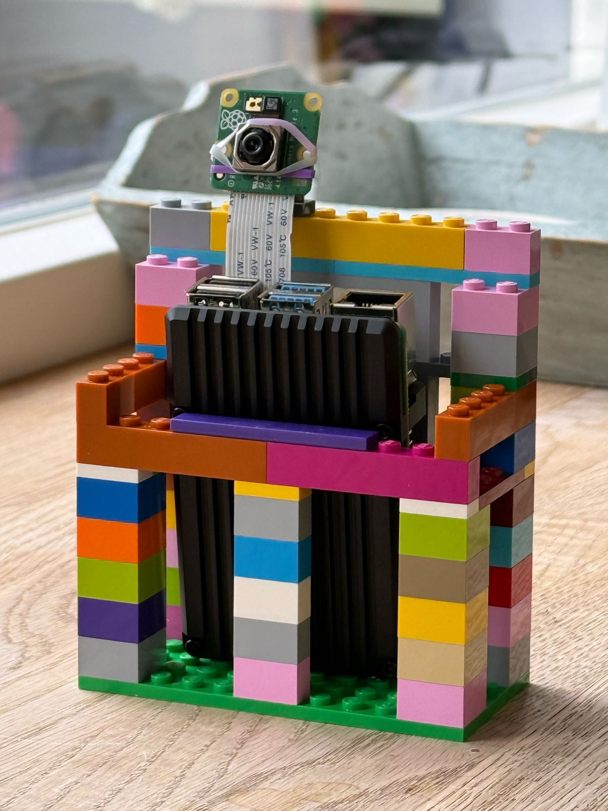
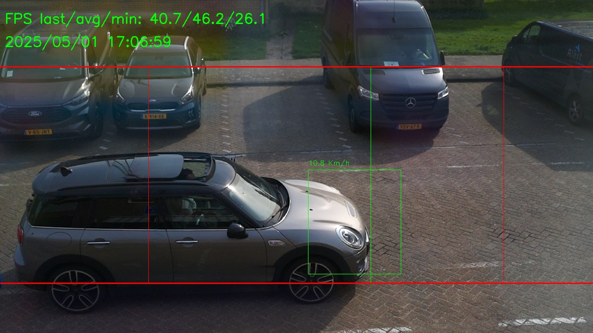
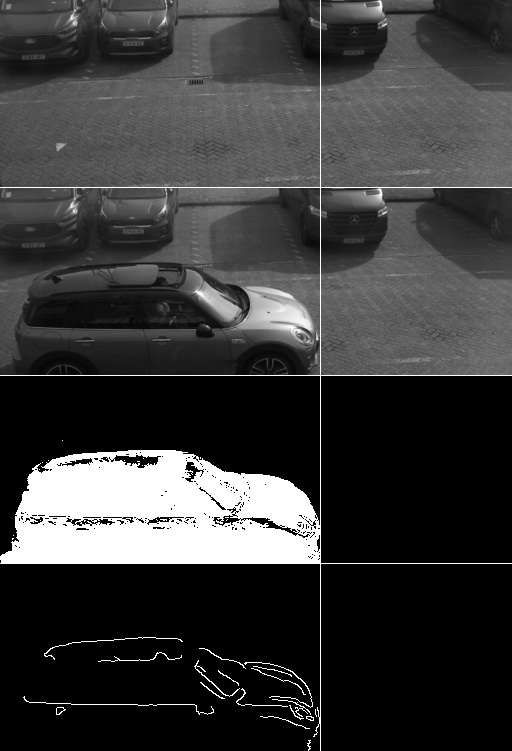

# Raspberry Pi Lap Detector for Slotem Extremus

Welcome to the camera-based lap detector component of the **Slotem Extremus** project!

## Definition and Scope

This component uses a camera connected to a Raspberry Pi to detect when a slot car crosses a meta line. When that happens, it sends an HTTP event to another server with the details, including the photo finish.

The camera is expected to be perpendicular to the track. It doesn't matter if it's at ground level or in a zenital view. This is how it looks when it detected me crossing the line in my car:

## Requirements

To enjoy this piece of software, you'll need:
* A **Raspberry Pi 4** (although it should also work on a 3, and aim to make it work even on a Zero 2 when ported to C++) using a regular Raspberry Pi OS (Lite should be enough, and even recommended).
* A **Raspberry Pi Camera Module 3**. In theory, any other camera compatible with the PiCamera2 library should work, and with very little effort it should also work with any camera supported by OpenCV.

## Status of the Project

I consider that this is an MVP (_Minimum Viable Product_) because:
* **It does the job**. Actually, it works better than I ever expected even for a final product. It does all I wanted (it detects cars very well and it sends the events to another server) and it's stable (running for hours with no issues).
* **It has a very good number of configuration possibilities**, some of them offered via an integrated web server, some of them offered through simple parameter edition.
* **It performs very well** (30+ FPS average when capturing at 720p and with real-time streaming enabled).
* **It monitors the system**: CPU usage, RAM pressure and CPU temperature are seen real-time.
* **The code is bad**. Really bad, seriously. It's just a prototype that happened to grow. Also, it's hitting the Python limits in terms of performance (specifically, in terms of concurrency capabilities).

Rather than refactoring its Python code, I aim to rewrite it in C++. The reason is that Python will anyways limit me in terms of performance, whereas with C++ the sky will be the limit.

I don't want to blame Python here though (even when I have a microtrauma because it fooled me with its fake threads). After all, Python allowed me to prototype and to try out new things super easily.

## But... why?

Well... why not? The history began around 2008, when some friends and I were missing a good lap counter for our slot car races.

We had a really old Windows .exe that used the parallel port from some really old laptop to detect changes in a photocell previously installed in a couple of holes under a piece of track. Not ideal, but very reliable.

Parallel ports were back then already a thing of the past, so we wanted something better. We consider Arduino as a very good idea to read photocells and even to implement speedtraps. I always wanted to do it based on computer vision, using just a webcam and OpenCV.

In 2025 (not kidding - this was in my to-do for 17 years...), I decided to make it happen. Instead of a webcam, I wanted to get a Pi a chance (everybody has one at home), as it would be cool to have a completely wireless device (when powered) monitoring the laps.

I started with this in March 2025. I wanted it to be ready by September 2026, when Lena & Xana would turn 6, so we could play slot together. I enjoyed it so much that the MVP was ready in less than two months (a milestone in software engineering: a project that happened actually sooner than expected).

## How does it work?

I could nerd a lot about this, because I enjoyed it to the fullest. I will keep it very simple:
1. You capture frames at a fast pace with the Picamera2 library. Since all the process that follows will be exhausting for the CPU, you scaled them down with OpenCV (you don't capture them in lo-res because you want to hi-res for the photo finish, of course) and you convert them to grayscale.
1. You need a background. Yeah, basically you need a reference against which you evaluate if there are changes (ie. cars passing by). I made it self-calibrating by the way.
1. You need to detect changes compared to that background. Specifically, OpenCV will find contours. What you do is to filter them out and act only on those bigger than certain threshold. This and the next step are those requiring the most resources of the Pi.
1. When you get a good contour, you try to track it. OpenCV has tools for this as well, and you have to choose them wisely. There're big differences in performance depending on the track you use, and depending on the area you track. Fine tuning the background building, the contour detection and the tracking, as well as building heuristics to reduce the load on your CPU, are an art in itself.
1. When tracking, you check whether the object leaves the frame, or whether it crosses the meta. To understand whether the car is crossing the meta, you check the difference between the frame and the background in the meta area, as the bounding box of the tracker is always bigger than the car (more on this on _the parallax problem_). When the difference goes beyond certain threshold, you trigger the appropriate event. The most reliable and accurate (to the pixel) way to do this is to actually use canny edge detection on the delta between the frame and the background. If the found edges are over the meta line, then you have a lap. 
1. You stream everything - that's the only proper way to understand what's going on with your system. You of course do this in a different thread, as the main loop is already super heavy and can't hold any more load (unless you want to see your FPS dropping...).

## Why do you need to detect and track contours? Why not just the edge contour over the meta line?

Dunno what ur talking bout...

## If the meta crossing is done with canny detection, and motion detection plus tracking are so heavy for the Pi, why don't you just focus on the actual meta crossing?

N/A

## But seriously...

OK, it's just overengineering as a consequence of not thinking upfront. Period.

Just basic edge detection over the meta could run even on a first generation Pi, or at least in a Pi 2 (the first multicore). I didn't do it as a first option because... I didn't think of it. It would have saved me many, many hours of coding and testing and optimizations.

Despite being _don't trust your GenAI companion at first - they also tend to overengineer_ a big finding, I also got a very good amount of technical learnings with this detour, namely:
* A very interesting foundation to computer vision. This has been in my to-do for longer than this project, actually, and it's done now.
* Finding out that multu-threading is not always _multi-threading_ when you leave the beautiful C++ world.
* Building the foundation for other projects.

Also, the current setup reduces the chances of false positives virtually to zero (I only check for meta crossing when tracking an object very close to the actual meta). Whether I would have implemented motion detection and tracking to reduce the false positives, we'll never know...

## What challenges did you find?

### Multi-threading
TLDR multi-threading in Python is a joke, and I only found it the hard way.

Coming from C++, I expect threads to be concurrent execution lines within my process, all of them sharing the same memory space. That's not the case in Python. In Python, they are not concurrent - period. There're workarounds that might or might not work. I explored them and I found myself putting a square peg in a round hole. That's when I decided to accept this as a very nice MVP and use real multithreading in C++ in the future.

I'm skipping the obvious: why do we need multi-threading in this app? It's just because there're many things going on at the same time, plus multi-core CPUs are an standard nowadays and it's a waste to not use them (the Pi has 4 cores since the 2nd generation). Unfortunately, Python will not use those extra cores because its threads are not OS threads.

### The parallax problem
When tracking an object, OpenCV will give you its bounding box. As long as the meta line is perpendicular to either the X or the Y axis, checking the overlapping between the bounding box and the meta line would be a good way to understand when a car is crossing.

That's what I thought, and I was wrong. I couldn't understand why the bounding boxes were crossing the meta line way earlier than the actual cars were touching the meta line. And it was not a matter of some specific offset that I could compensate: it was random. The clue was that the problem didn't exist when tracking bikes instead of cars. Why that?

The problem was always in front of my eyes: when a car comes by one side of the frame, you see both the front of the car and its side, and you start tracking the whole thing. As it gets to the center of your frame (typically where the meta line is), you only see the side because the front gets hidden with the new perspective. However, the tracker expects the front to be there at some point, so it gives you a bounding box with allocated room for that (now hidden) front of the car. And because of that, your bounding box is actually ahead of the car when it crosses the line. Bikes didn't show this problem because they have virtually no depth.

This would still be enough to count laps. However, I always wanted to have a photo finish of my laps, so I ended up with an extra step in my detection logic: when the bounding box was crossing the meta line, I added some canny edge detection to check if the car was actually touching the meta line at the pixel level.

Overengineered? Maybe, but it was fun, challenging and insightful, so I'm happy I did it.

### The auto-exposure complication

Sometimes, the trackers fail. You never know whether it is because the object dissapeared, or whatever. What you do is to fall back to detect contours again.

One thing that used to happen very often was that when the cars were very large (typically, vans), the tracker would fail and the contour detection would struggle to stay above 10 FPS. Why that? I had no idea...

I started to stream not the real video but the internal images instead. I noticed that sometimes the detected contours were not just around the cars or the vans, but everywhere, so the contour processing logic was processing dozens of wrong contours. It was like the background was broken when large cars were in the frame, and I couldn't get why.

It didn't make sense, and I was lost for a lot of time until, out of the blue, I found the reason: when a large object came into the frame, chances were that the whole image would be either lighter or darker, and the camera auto-exposure was making the image either darker or lighter to compensate. When the image was all of a sudden either lighter or darker, the contour detection was finding deltas compared to the background everywhere! And chaos happened.

The fix was simple: I lock the exposure when the tracking of a car begins, and I re-enable it when the car leaves the frame. So easy to explain, so easy to fix, so difficult to spot...

## What about the future?

This is nothing but a hobby projects to learn and have fun. That's all about it.

The question, then, is _what do I want to learn next?_. The answers:
* I want to code C++ again. It's fast, it's hardcore, it's almost old school... and I miss it, plus I need it to overcome the limitations of the Pi's hardware. Yes, I could just get a faster Pi, or a faster mini computer; but:
  * Then I wouldn't be learning, plus...
  * I truly believe that if your first solution to performance problems is to have new hardware, you're not a good engineer, plus...
  * The fun is in it being challenging!
* I want to change the underlying logic, with a circular queue of frames with the following workers acting on it:
  * A frame provider, which will take care of capturing the frame and doing the basic corrections (resizing, grayscale, etc).
  * A motion detector+tracker, which will take care of the heavy logic. I want it to be smart enough to skip some frames if the collection is building faster than I'm processing them (and we're not too close to the meta). As contour detection is usually the bottleneck, I could even do pre-emptive contour detection (ie. two frames being processed at the same time).
  * A post-processor, which will either ignore the frames in the queue or send them to the meta processor (when that's the case) or to the streamer (when needed). The meta processor will be able to fetch previous frames from the queue (ie. it will enable the _video finish_).
* I want to give YOLO and so a try. I could have added an AI hat from the beginning to the Pi, but then [_put the reasons above about learning and having fun here_]. Now that things are working, I feel that adding AI (for instance, to detect the model of the car) would be awesome.

## TO-DO/Ideas list

Below there's a mix of ideas, bugs, and random notes to use as inspiration in the future.

### Bugs
* STREAM_SCALING is not used

### Little improvements
* Line_X as a percentage
* Use nanotime from capturerequest instead of system time
* Show two streamings (real frame, processed images)
* Support disable streaming

### Big improvements
* Event retry should be different depending on what:
  * Very fast for metadata
  * Quite slow for images
* Metadata and images should fly in different pipelines (and we shouldn't try images before succeeding with metadata)
* When tracking, do it only within a ROI for efficiency. Two parameters are needed: horizontal jump and vertical jump.
* What about a pre-emptive contour detection? Like 2 frames at the same time. Worst case scenario, one frame has to be discarded when tracking initiates...
* Adjust the whole background thing. We spent a lot of time on this and it happened to be an issue with the autoexposure!
* Support the scenario when a car jumps the meta (ie. canny never overlaps the line)
* Acurate timing of meta crossing (we would need to interpolate between pre and post-meta)

